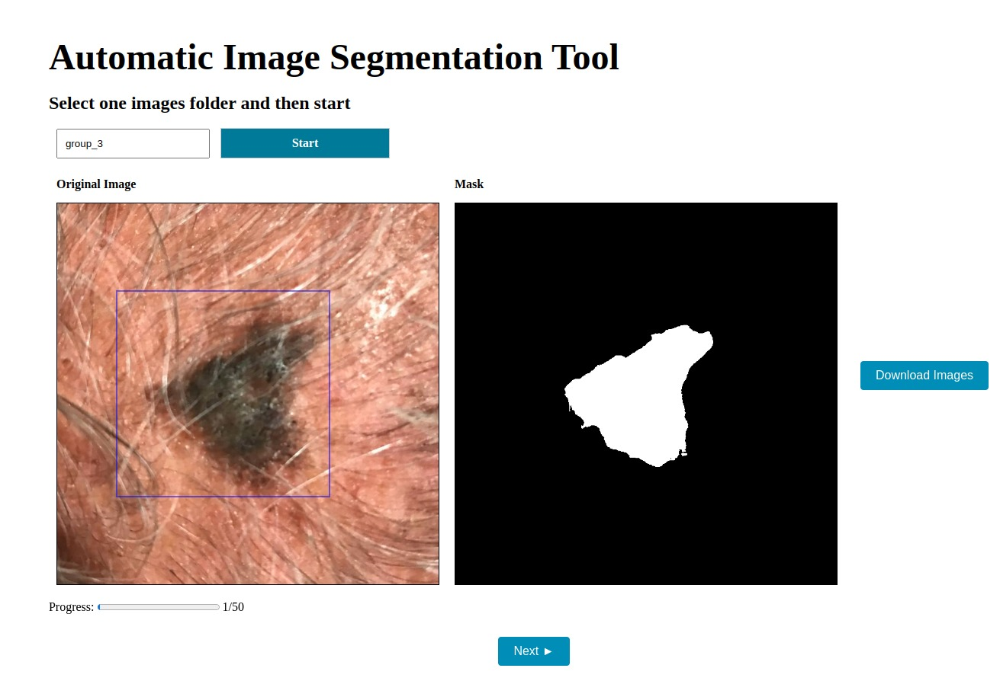

# Ferramenta de Segmentação

Este repositório contém o código para a ferramenta de segmentação que é utilizada para segmentar imagens manualmente ou com a ajuda do [Segment Anything Model (SAM)](https://arxiv.org/abs/2304.02643). 

## Instalação

Primeiramente, você precisa baixar os checkpoints do SAM [aqui](https://dl.fbaipublicfiles.com/segment_anything/sam_vit_h_4b8939.pth) e colocá-los na pasta `sam-server`.

Em seguida, se você não tiver o Docker instalado, será necessário instalá-lo juntamente com o Docker Compose. Você pode encontrar as instruções [aqui](https://docs.docker.com/get-docker/).

Por fim, basta executar o seguinte comando:

```bash
docker-compose up -d
```

Se tudo ocorrer bem, você poderá acessar a aplicação em `localhost:4002`.

## Como Usar

Para utilizar a aplicação, você precisa criar uma pasta chamada `images` dentro da pasta `sam-server`. Dentro dessa pasta, você pode criar seus grupos de imagens para segmentação. Um exemplo de caminho é `sam-server/images/group_1`.

Dentro da pasta do grupo, você deve colocar as imagens que deseja segmentar.

Após isso, acesse a aplicação em `localhost:4002`. Aqui, você encontrará 3 opções:


- `Segmentação Manual`: utilize para segmentar as imagens manualmente.
  
- `Segmentação com Box e SAM`: utilize para segmentar as imagens com a ajuda do modelo SAM utilizando uma caixa como prompt.
  
- `Pré-Processamento de Pasta`: indique uma pasta de grupo dentro da pasta `sam-server/images` para pré-processar as imagens antes de segmentá-las (mais informações abaixo).

Se o seu servidor de API não estiver rodando no `localhost` na porta `5000`, certifique-se de criar e atualizar o `API_URL` no arquivo `.env`.

## Anotação Manual

Se você deseja segmentar as imagens manualmente, clique no botão `Segmentação Manual`. Você verá a seguinte tela:


Aqui, indique o nome da pasta do grupo a ser segmentado (a pasta deve estar dentro da pasta `sam-server/images`) e clique em `Select Images Folder`.

As imagens serão carregadas uma a uma e você poderá segmentá-las desenhando sobre a imagem original. Você verá a máscara no lado direito da tela. Quando terminar, clique em `Next` para ir para a próxima imagem. Se algo der errado com a máscara, clique em `Reset` para recomeçar.


## Anotar com SAM

Para anotar as imagens com a ajuda do SAM, o primeiro passo é pré-processar as imagens. Esta etapa é necessária porque o SAM pode demorar para gerar os dados requeridos para a segmentação. O pré-processamento das imagens melhora a experiência do usuário, gerando os dados necessários antecipadamente.

Para pré-processar as imagens, defina a pasta do grupo (dentro da pasta `sam-server/images`) e clique em `Pré-Processamento de Pasta`.


Após o pré-processamento, um arquivo `.pkl` é criado para cada imagem na pasta. Esse arquivo contém os dados que o SAM precisa para segmentar a imagem, juntamente com o prompt (neste caso, uma caixa).

Note que o pré-processamento pode levar um tempo (5-10 minutos para 50 imagens), mas é um processo único. Uma vez concluído, você poderá segmentar as imagens sem precisar esperar novamente.

Agora, escolha `Segmentação com Box e SAM`. O processo é similar à segmentação manual, mas agora você verá a máscara gerada pelo SAM com base na caixa que você desenhar.

Exemplo de segmentação com caixa:


## Download dos Resultados

Após concluir as anotações, você pode baixar os resultados clicando no botão `Download`. Os resultados serão baixados em um arquivo `.zip`.

Se você encontrar algum problema durante esta etapa, todos os resultados são salvos na pasta `sam-server/sessions`.
