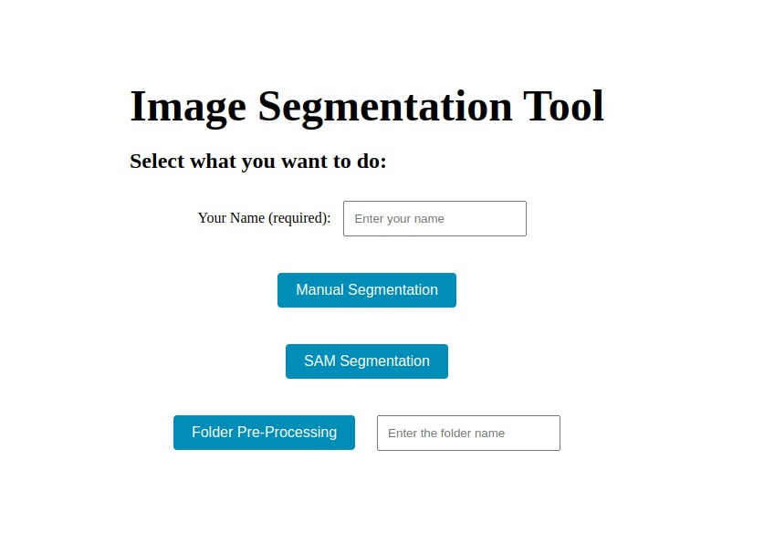
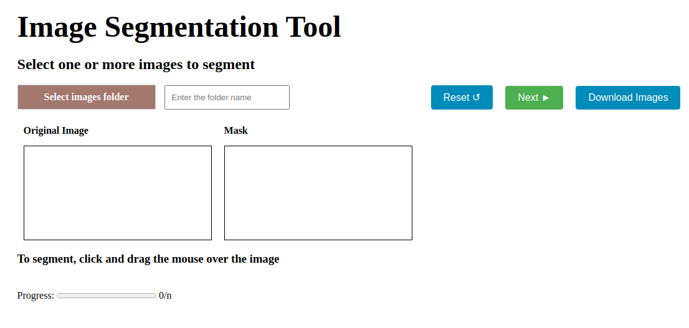
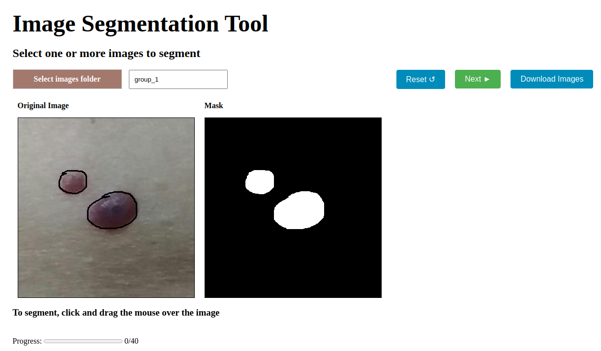
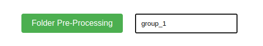
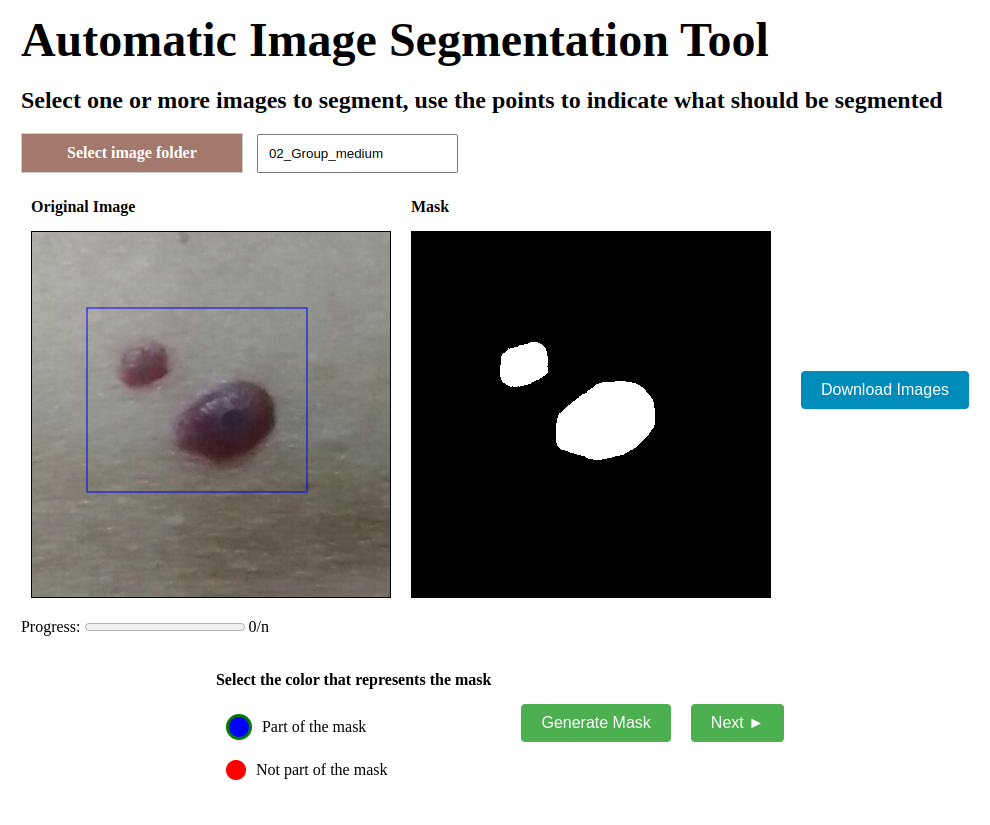

# Segmentation tool

This repository contains the code for the segmentation tool that is used to segment images manually or with the help of the [Segment Anything Model (SAM)](https://arxiv.org/abs/2304.02643). 

## Installation

First of all, you need to download the SAM checkpoints from [here](https://dl.fbaipublicfiles.com/segment_anything/sam_vit_h_4b8939.pth) and put it in the folder `sam-server`.

Next, if you don't have Docker installed, you need to install it and Docker Compose. You can find the instructions [here](https://docs.docker.com/get-docker/).

Finally, all you need to do is run the following command:

```bash
docker-compose up -d
```

If everything goes well, you can access the application on `localhost:4002`.

## How to use it

To use the application, you need to create a folder called `images` inside the folder `sam-server`. Then, inside this folder, you may create your image groups to segment. An example of path is `sam-server/images/group_1`.

Inside the group folder, you need to put the images you want to segment.

After that, you can access the application on `localhost:4002`. Here, you have 3 options:



- `Manual segmentation`: use it to segment the images manually.
  
- `Box with SAM segmentation`: use it to segment the images with the help of the SAM model using a box as prompt.
  
- `Folder Pre-Processing`: indicate a group folder inside the `sam-server/images` folder to pre-process the images before segmenting them (more info below).

If your API server is not running on `localhost` at port `5000`, make sure to create and update the `API_URL` in the `.env` file.

## Manual annotation

If you want to segment the images manually, click on the `Manual segmentation` button. You will see the following screen:



Here, indicate the name of the group folder to segment (the folder must be inside the `sam-server/images` folder) and click on `Select Images Folder`. 

The images will be loaded one by one and you can segment them by drawing on the original image. You'll see the mask on the right side of the screen. When you finish, click on `Next` to go to the next image. If you did something wrong in the mask, click on `Reset` to start over.



## Annotate with SAM

To annotate the images with SAM's help, the first step is to preprocess the images. This step is necessary because SAM may take a long time to generate the data required for segmentation. Preprocessing the images improves the user experience by generating the necessary data beforehand.

To pre-process the images, set the group folder (inside the `sam-server/images` folder) and click on `Folder Pre-Processing`. 



After preprocessing, a `.pkl` file is created for each image in the folder. This file contains the data that SAM needs to segment the image along with the prompt (in this case, a box).

Note that preprocessing may take a while (5-10 minutes for 50 images), but it is a one-time process. Once complete, you can segment the images without waiting again.

Now, choose `Box with SAM segmentation`. The process is similar to the manual segmentation, but now you will see the mask generated by SAM based on the box prompt you draw.

Example of box segmentation:


## Downloading the results

After completing the annotations, you can download the results by clicking on the `Download` button. The results will be downloaded in a `.zip` file.

If you encounter any issues during this step, all results are saved in the folder `sam-server/sessions`.
