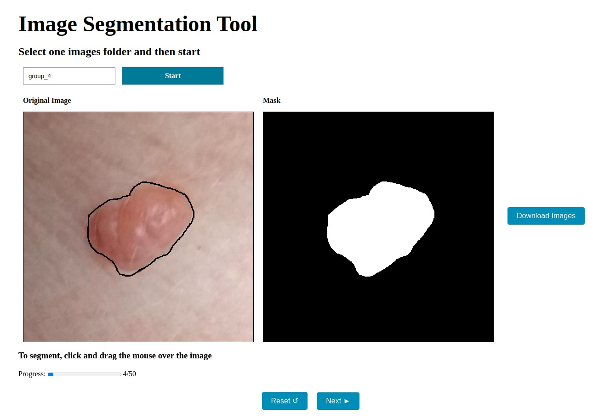

# Segmentation tool

This repository contains the code for a segmentation tool that supports manual masks and SAM2-assisted segmentation (2024 release of Segment Anything). 

## Installation

This project now uses only SAM2. Download a SAM2 checkpoint plus its config file (e.g. `sam2_hiera_l.yaml` and the corresponding `.pt`) and place them inside `sam-server` (or mount via a Docker volume). Provide their paths through environment variables:

```
SAM_CHECKPOINT=/app/sam2_checkpoint.pt
SAM2_MODEL_CONFIG=sam2_hiera_l.yaml
```

Next, if you don't have Docker installed, you need to install it and Docker Compose. You can find the instructions [here](https://docs.docker.com/get-docker/).

Finally, all you need to do is run the following command:

```bash
docker-compose up -d
```

If everything goes well, you can access the application on `localhost:4002`.

## How to use it

To use the application, you need to create a folder called `images` inside the folder `sam-server`. Then, inside this folder, you may create your image groups to segment. An example of path is `sam-server/images/group_1`.

Inside the group folder, you need to put the images you want to segment.

After that, you can access the application on `localhost:4002`. Here, you have 3 options:


- `Manual segmentation`: use it to segment the images manually.
  
- `Box with SAM segmentation`: segment the images with SAM2 using a box prompt.
  
- `Folder Pre-Processing`: (legacy button) now just validates the folder; SAM2 no longer needs an embedding preprocessing step.

If your API server is not running on `localhost` at port `5000`, make sure to create and update the `API_URL` in the `.env` file.

## Manual annotation

If you want to segment the images manually, click on the `Manual segmentation` button. You will see the following screen:



Here, indicate the name of the group folder to segment (the folder must be inside the `sam-server/images` folder) and click on `Select Images Folder`. 

The images will be loaded one by one and you can segment them by drawing on the original image. You'll see the mask on the right side of the screen. When you finish, click on `Next` to go to the next image. If you did something wrong in the mask, click on `Reset` to start over.


## Annotate with SAM2

Choose `Box with SAM segmentation`. The process is similar to manual segmentation, but you will see the mask generated by SAM2 based on the box you draw. No preprocessing wait is needed anymore.

Example of box segmentation:


## Downloading the results

After completing the annotations, click `Download` to get a `.zip` with originals and masks.

If you encounter any issues during this step, all results are saved in the folder `sam-server/sessions`.
