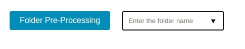

# Segmentation tool

This repository contains the code for the segmentation tool that is used to segment images manually or with the help of the [Segment Anything Model (SAM)](https://arxiv.org/abs/2304.02643). 

## Installation

First of all, you need to download the SAM checkpoints from [here](https://dl.fbaipublicfiles.com/segment_anything/sam_vit_h_4b8939.pth) and put it in the folder `sam-server`.

Next, if you don't have Docker installed, you need to install it and Docker Compose. You can find the instructions [here](https://docs.docker.com/get-docker/).

Finally, all you need to do is to run the following command:

```bash
docker-compose up -d
```

If everything goes well, you can access the application on `localhost:4002`.

## How to use it

To use the application, you need to create a folder called `images` inside the folder `sam-server`. Then, you, inside this folder, you may create your image groups to segment. An example of path is `sam-server/images/group_1`.

Inside the group folder, you need to put the images you want to segment.

After that, you can access the application on `localhost:4002`. Here, you have 4 options:


- `Manual segmentation`: use it to segment the images manually.
  
- `Dots with SAM segmentation`: use it to segment the images with the help of the SAM model using as prompt dots within the image.
  
- `Box with SAM segmentation`: use it to segment the images with the help of the SAM model using as prompt a box within the image.
  
- `Folder Pre-Processing`: indicate a group folder inside the `sam-server/images` folder to pre-process the images before segmenting them (more info bellow).

## Manual annotation

If you want to segment the images manually, you can click on the `Manual segmentation` button. You will see the following screen:


Here, you must indicate the name of the group folder to segment (again, the folder must be inside the `sam-server/images` folder). Then click on `Select Images Folder`. 

Next, the images will be loaded one by one and you can segment them by drawing on the original image. You're going to see the mask on the right side of the screen. When you finish, click on `Next` to go to the next image. If you did something wrong in the mask, just click on `Reset` to start over.


## Annotate with SAM

In order to annotate the images with the SAM's help, the first step is to preprocess the images. This step is necessary because SAM may take a long time to generate the data to segment the images. So, to improve user experience, we preprocess the images before segmenting them.

To pre-process the images, you need to set the group folder (inside the `sam-server/images` folder) and click on `Folder Pre-Processing`. 



After that, the images will be pre-processed and you may see inside the folder that a `.pkl` file is created to each image. This file contains the data that SAM needs to segment the image along with the prompt (in this case, a box or dots).

It's important to note that the pre-processing may take a while (5-10min for 50 images). However, it is a one-time process. After that, you can segment the images without waiting for the pre-processing.

Now, you must choose between `Dots with SAM segmentation` or `Box with SAM segmentation`. The difference between them is the prompt you're going to use to segment the image. The process is similar to the manual segmentation, but now you're going to see the mask generated by SAM according to the dots or box you draw.

Example of dots segmentation:


Example of box segmentation:


**Note:** in our experience, the box prompt is more robust than the dots prompt. Thus, we recommend using the box prompt.


## Dowloading the results
After doing all anotations, you can download the results by clicking on the `Download` button. The results will be downloaded in a `.zip` file.

However, if you face any problem in this step, all results are saved in the folder `sam-server/sessions`.
